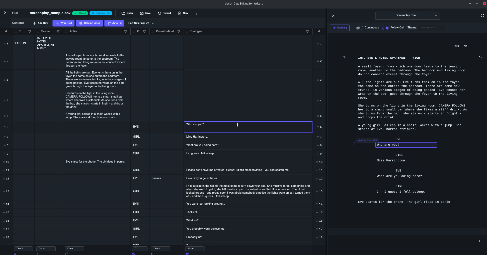

# Seria

**Multimodal serialized data editor for game writers and narrative designers.** Seria lets you work directly with primitive data files (**CSV and TSV**, with **JSON coming soon**) while viewing and editing your content in writer-friendly formats like Screenplay and Corkboard views, as well as data-friendly views like Graph and Record editors. Changes made in any view sync instantly across all views - no import/export step, no duplication, just your raw data in whatever format feels best for what you're doing.

- **GitLab (main repo):** [https://gitlab.com/parkerhdavis/Seria](https://gitlab.com/parkerhdavis/Seria)
- **GitHub (mirror repo):** [https://github.com/parkerhdavis/Seria](https://github.com/parkerhdavis/Seria)
- **Issues:** [GitLab Issues](https://gitlab.com/parkerhdavis/Seria/-/issues)
- **Releases:** [GitLab Releases](https://gitlab.com/parkerhdavis/Seria/-/releases) (coming later this month)

---

*Screenshot from dev build 2025-11-13*

---

## The Problem

Game writers need primitive data sources, but the tools available force painful trade-offs:

### Spreadsheets (Excel, Google Sheets, Unreal Data Tables)

**What's great for games:**
- ✅ Primitive, text-based data formats play nicely with version control
- ✅ Easy integration into game engines and build pipelines
- ✅ Bulk editing and analysis is super simple (that's what sheets are *for*, after all)
- ✅ Team collaboration (either RTC or VCS) is built-in or easy to implement
- ✅ Makes you feel like a power user and keeps you tethered to developer-space

**What's hard for writers:**
- 🚫 Working in cells (or worse, struct rows) doesn't always feel natural
- 🚫 Difficult to feel pacing and flow, especially for cinematics and long conversations
- 🚫 The medium is the message: cellular editing shapes your writing (sometimes in a bad way)
- 🚫 Constant context-switching between "data mode" and "writer mode" can burn you out
- 🚫 I mean, you know, it just feels sad sometimes

### Writing Tools (Final Draft, FadeIn, Scrivener)

**What's great for writers:**
- ✅ Rich, writer-friendly composition experience, especially for dialogue
- ✅ Much easier to read linearly for editing and proofreading
- ✅ Proper screenplay/dialogue formatting to read aloud or share with actors
- ✅ Card views and organizational tools to zoom out for plot and pacing
- ✅ Like a warm, cozy blanket to curl up and write in

**What's hard for games:**
- 🚫 Proprietary or complex data sources that lock you into specific tools
- 🚫 Not friendly to integration or version control
- 🚫 Even tools that exporting to CSV/JSON open the door to errors and multiple points of authority
- 🚫 Difficult-to-impossible to integrate directly into game engine pipelines
- 🚫 You'll be happy; everyone else will be sad

---

## The Seria Solution

Seria sits directly on top of your data files. no import/export step, no conversion, no duplication. Your data file stays the single source of truth while you view and edit it through a rich cellular editor and multimodal rendered views (what I call Prints) that accommodate far more ways writers actually think.

### Feature Comparison

| Feature                               | Excel/Sheets | Final Draft/Scrivener | **Seria**     |
| ------------------------------------- | ------------ | --------------------- | ------------- |
| Primitive data format (CSV/TSV, JSON) | ✅            | 🚫                    | ✅ (JSON soon) |
| Git-friendly / version control        | ✅            | 🚫                    | ✅             |
| Screenplay formatting                 | 🚫           | ✅                     | ✅             |
| Card/corkboard view                   | 🚫           | ✅                     | ✅             |
| Edit directly in formatted view       | 🚫           | ✅                     | ✅             |
| Bidirectional sync                    | 🚫           | 🚫                    | ✅             |
| Game engine integration               | ✅            | 🚫                    | ✅             |
| Formulas, calculations, validations   | ✅            | 🚫                    | 💡 (soon)     |
| Real-time collaboration / cloud sync  | ✅            | Limited               | 🚫 (not yet)  |
| Custom print templates                | 🚫           | Limited               | ✅             |

**Seria gives you the data discipline and flexibility of sheets with the fluid experience of dedicated writing tools.**

---

## Key Features

### Cell View (Spreadsheet Editor)
Traditional CSV editing with powerful features:
- Filter and sort to focus on specific content
- Find and replace across your data
- Multi-cell selection and bulk operations
- Column summaries (count, average, min, max, etc.)
- Drag-and-drop row/column reordering
- Full undo/redo support

→ [Complete Cell View Guide](wiki/02_Cell%20View/01.00_The%20Cell%20View.md)

### Print Views (Writer-Friendly Formats)
View and edit your CSV data in rich formats:
- **Screenplay** - Industry-standard screenplay format for cinematics
- **Dialogue** - Clean dialogue view for conversations and barks
- **Corkboard** - Card-based view for story beats and planning
- **Record Editor** - Database-style forms for detailed editing
- **Charts** - Visual data representations for relationships and flow
- **Custom Prints** - Create your own formats specific to your workflow

→ [Print View Guide](wiki/03_Print%20View/02.00_The%20Print%20View.md)

### Bidirectional Editing
The killer feature: **edit in any view, changes sync everywhere.**
- Change dialogue in Screenplay view → CSV updates instantly
- Reorder cards in Corkboard view → row order updates in CSV
- Edit a cell in spreadsheet view → Print views update
- Always working with the same data, just different views

→ [Bidirectional Editing Explained](wiki/03_Print%20View/02.01_Bidirectional%20Editing.md)

### Multi-Platform & Local-First
- **Windows & Linux** - Native desktop app (macOS support planned for future release)
- **Local-first** - Your data stays on your machine, works offline
- **Fast & lightweight** - Small installer (~10-15MB), native performance
- **No vendor lock-in** - Plain CSV files you own forever

→ [Installation Guide](wiki/01_Introduction/00.03_Installation.md)

---

## Installation

> [!NOTE] Coming Soon
> The first packaged release will drop later this month. Stay tuned!

Formats available on [GitLab Releases](https://gitlab.com/parkerhdavis/Seria/-/releases):

- **Linux:** `.AppImage` (universal), `.deb` (Debian/Ubuntu), `.rpm` (Fedora/RHEL)
- **Windows:** `.msi` or `_setup.exe`

**Note:** macOS builds are planned for a future release.

→ [Detailed installation instructions for all platforms](wiki/01_Introduction/00.03_Installation.md)

---

## Documentation

**Getting Started:**
- [Installation](wiki/01_Introduction/00.03_Installation.md) - Install on Windows, macOS, or Linux
- [Is This App for You?](wiki/01_Introduction/00.02_Is%20This%20App%20for%20You.md) - See if Seria fits your workflow

**Using Seria:**
- [Cell View Guide](wiki/02_Cell%20View/01.00_The%20Cell%20View.md) - CSV editing features
- [Print View Guide](wiki/03_Print%20View/02.00_The%20Print%20View.md) - Using Print views
- [Print Recipes](wiki/03_Print%20View/02.02_Print%20Recipes.md) - Creating custom formats

**Reference:**
- [Keyboard Shortcuts](wiki/04_Customization/03.02_Keyboard%20Shortcuts.md) - All shortcuts
- [FAQ](wiki/06_FAQ%20and%20Support/04.00_FAQ.md) - Frequently asked questions
- [Current Limitations](wiki/06_FAQ%20and%20Support/04.01_Current%20Limitations.md) - Known issues and missing features

**Developer Docs:**
- [Developer Quick Start](wiki/05_Development/05.01_DeveloperQuickStart.md) - Get started developing Seria
- [Development Guide](wiki/05_Development/05.02_DevelopmentGuide.md) - Development setup and workflow
- [Building and Distribution](wiki/05_Development/05.03_BuildingAndDistribution.md) - Building from source
- [Cross-Compilation](wiki/05_Development/05.04_CrossCompilation.md) - Building Windows installers on Linux
- [Contributing](wiki/05_Development/05.07_Contributing.md) - How to contribute to Seria

---

## Links

- **GitLab (main repo):** [https://gitlab.com/parkerhdavis/Seria](https://gitlab.com/parkerhdavis/Seria)
- **GitHub (mirror repo):** [https://github.com/parkerhdavis/Seria](https://github.com/parkerhdavis/Seria)
- **Issues:** [GitLab Issues](https://gitlab.com/parkerhdavis/Seria/-/issues)
- **Releases:** [GitLab Releases](https://gitlab.com/parkerhdavis/Seria/-/releases)

---

## Technology

Tauri 2.0 + React 18 + TypeScript + Vite + TailwindCSS + daisyUI

---

## Inspiration

Seria was inspired by tools like [Obsidian](https://obsidian.md/) that demonstrate what's possible with local-first experiences built on top of simple, portable file formats. Just as Obsidian provides a powerful editing environment while keeping notes as plain markdown files, Seria provides rich writing views while keeping your data as plain CSV/TSV/JSON files.

---

## License

Covered under the GPL License, see [LICENSE](./LICENSE.md)

Beyond that, I only have one rule: **First, do no harm. Then, help where you can.**

---

## Financial Support

If you have some cash to spare and want to help out, that's very kind. I'm doing alright, so rather than sharing that kindness with me, I encourage you to share it with your charity of choice. Mine is the [GiveWell top charities fund](https://www.givewell.org/top-charities-fund) , which does excellent research to figure out which causes can save the most human lives for the money, and put their funds there.

For example: their grant to the [Against Malaria Foundation](https://www.againstmalaria.com) delivered outcomes at a cost of just $1,700 per life saved.

